# How to migrate a WordPress site to Strapi with Claude Code

**TL;DR**

- A Claude Code skill reads your WordPress site through its REST API, works out matching Strapi
  v5 content types, and writes a migration you review before anything moves.
- Most of the work happens before you run anything. Decide what you are not moving, settle what
  your URLs will be, and pick what you want to fix in the model while fixing it is still a line
  in a config file.
- The hard part is not moving the data. It is deciding which fields are content and which are
  theme settings, and which pages are structured enough to be worth keeping as structure.
- One failure mode is silent, so check for it first. WordPress hides post types and custom fields
  from its own REST API unless somebody switched them on, which means a migration can finish with
  no errors and still be missing half your content.
- Practice on a throwaway site first. This repo builds one for you in about a minute, with the
  hard parts already in it.
- We ran the skill against two real sites, one built for this repo and one commercial theme's
  demo content. Everything below is what those runs produced.

We will go through what a WordPress migration actually involves, what to expect on your own
site, and how to run one with Claude Code. The demo site here is a practice ground. The goal is
that you can do this to a site you care about.

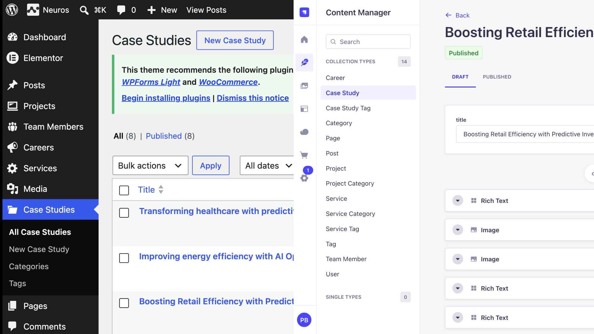

## What a migration actually moves

Strapi is a headless CMS. Headless means it has no front end of its own. It stores your content
as structured fields, serves them over an API or via MCP, and leaves the rendering to something else: a
Next.js site, a mobile app, whatever you build. 

WordPress works the other way. It ships the content and the website as one thing, which is why installing a theme changes how your posts look.

That difference decides what a migration can carry, so it is worth being clear about the differences.

A WordPress site holds two kinds of thing side by side. There is content: a post title, the
words in the body, a featured image, the category it belongs to. There is also presentation: the
layout, the colors, the sidebar widget, the order of sections on the home page. Both sit in the
same database, and sometimes in the same fields.

Strapi takes the first and not the second. Titles, body text, images, dates and relations all
move across. Your theme does not, and neither do the settings that exist for it.

That sounds like a loss until the content has to appear somewhere other than the page it was
written on. 

A post stored as theme-shaped HTML is only usable by something that renders HTML the
same way. A post stored as fields can be read by anything: your website, an iOS app, a kiosk
screen, a newsletter builder, a second brand's site, a search index. One entry, many places.

That is what people mean by multi-channel, and it is the whole reason to store content as fields
rather than as pages.

Getting that benefit depends on how you structure the content, and five habits carry most of
the weight:

- **One idea per field.** A price is a number, not a sentence with a number in it. A launch date
  is a date. Then a front end can sort by price, and you can ask for everything launched this
  year without parsing strings.
- **Things that repeat become their own collection.** If five articles name the same author,
  that author is one entry with a relation to each article, not a name typed five times. Change
  their job title once and every article follows.
- **Sections that repeat become components.** A landing page made of a hero, three features and
  a call to action is five pieces in order, not one block of markup. An editor can reorder them
  without touching code.
- **A page built of varied sections becomes a dynamic zone.** Components are the pieces. A
  dynamic zone is the slot they drop into, holding an ordered list of mixed ones: hero, then
  rich text, then a gallery, then a call to action. Each page chooses its own set and its own
  order, and an editor rearranges them by dragging, not by editing markup.
- **A field type Strapi lacks is one you can add.** Text, number, date, boolean, media and
  relations ship with it. Anything else is a custom field: a small plugin that registers a new
  type so it appears in the Content-Type Builder beside the built-in ones. A color picker, a
  map location, a star rating.

So a migration is not a copy. Every field has to land in one of three piles: content that moves,
presentation that stays behind, and the pile that looks like one but is really the other. That
third pile is where the judgment goes, and most of this post is about it.

Four questions decide how yours will go. Answer them before you start.

**What content types does the site actually have?** Not what the menu shows. WordPress calls
these post types. Posts and Pages come as standard. A plugin or theme can register more:
Services, Team, Projects, Vacancies. Each one becomes a collection type in Strapi.

**Which fields are which?** This is the third pile from a moment ago, and it is worth knowing
how hard it can get. `client_name` is obviously content and `header_background_color` is
obviously not. The awkward ones sit between: a `subtitle` that half your entries use as a real
subheading and the other half leave blank because the theme hides it, or a `featured` checkbox
that drives a carousel. Both arrive through the same channel and look identical in the database.

**How were the pages built?** A page written in the block editor is text with some structure.
A page built with Elementor is a layout description. Those two need different treatment, and
mixing them up is how you end up with a wall of flattened HTML in your new CMS.

**Which URLs have to keep working?** Find out before you decide anything, because the answer is
rarely all of them. Check analytics for the pages that actually get traffic, Search Console for
what ranks, and your inbox for the links sitting in old newsletters. A page nobody has visited in
three years does not constrain your new URL scheme. Your top twenty do.

## Decisions to make before you start

The mechanical part of a migration is quick. The deciding is what takes the time, and most of it
can happen before you run anything.

**Treat it as a loop, not an event.** Your first run will be wrong somewhere. That is the
expected outcome rather than a failure. Entries are matched on their WordPress id and their
source site, so running it again updates what is already there instead of making a second copy.
Budget for three or four passes: run it, read what it flagged, change the config, run it again.

**Decide what you are not moving.** This is the cheapest decision available and the one people
skip. Nine years of posts, an events type nobody has touched since 2021, three hundred images
attached to nothing. Leaving those behind costs nothing, and everything you bring across is
something you have to check.

**Settle the URLs early.** If your posts stay at `/2019/05/our-kitchen/` you need no redirects at
all. If they move to `/blog/our-kitchen/` you need one for every post. That choice is much harder
to reverse once the new site is live and indexed.

**Remember Strapi is half the job.** It holds your content and serves it over an API. It does not
render your site, so you still need a front end.

That used to be the larger half of the project. It is less so now, and for a reason that comes
straight out of the migration: you finish it holding a defined content model. Every type, every
field, every relation is declared, which is the thing a front end needs to know. Claude can read
those content types and build pages against them, and Strapi ships an MCP server, so an AI client
can query your real content while you work rather than guessing at the shape of it. Point it at
`/mcp` with an admin token and the tools are generated from your own schema.

Plan for it as a second piece of work. 

**Involve whoever edits the site.** The content model you end up with is what they will use every
day. A field called `field2`, or a page that arrives as one undifferentiated block of rich text,
is a decision you made on their behalf.

**Work from a copy.** Never rehearse on the live site. Local makes one in a couple of minutes,
and this post's demo site exists so you can practice on something disposable first.

## Improving the model while you move it

A migration is the best moment you will ever get to fix your content model. Today, turning
three loose fields into one component is a line in a config file. Once five thousand entries are
in Strapi and a front end is reading them, the same change is a data migration and a release.

The shape WordPress hands you is often an accident. It is the sum of which plugins somebody
installed, what the theme needed, and what got added in a hurry three years ago. You are not
required to reproduce it.

| What WordPress gives you | What you can have instead |
|---|---|
| `specialties: ["branding", "ui", "strategy"]` as text on every team member | a `Skill` collection with relations, so you can ask who does branding |
| a Work page listing your six projects as copy | a relation to the six `portfolio_item` entries, so the page follows them |
| `header_background_color`, `page_title_padding` | nothing. That belongs in the front end |
| a body that is one block of rich text on a page that is really five sections | a dynamic zone, so an editor can move a section without editing HTML |

Some of this the skill does without being asked. It collapses a flattened ACF group into one
component, types `"20240415"` as a date rather than a number, drops keys that look like theme
settings, strips a vendor prefix so `neuros_service` becomes `service`, and turns a repeating
field into a repeatable component. Those are safe because the evidence is in the data.

Some of it is a config edit at the review step. Choosing `dynamic-zone` over `blocks` for a type,
renaming a field, deleting one, pulling a key back out of the ignored list: all of that is
changing `migration.config.json` before anything is generated.

And some of it the skill will not do for you today. It flags a page that repeats a collection,
but it will not rewrite that page into a relation, because deciding a paragraph *is* a given
entry is a judgment call and a confident wrong guess replaces real content with a link to the
wrong thing. It has no way to promote `specialties` into a `Skill` collection either: that means
inventing a collection WordPress never had and filling it from the distinct values of a field.
Both are worth doing by hand afterwards, in the Strapi admin or with a short script, once the
content is in and you can see it.

**Where to stop.** Every change is also a change your front end has to handle, and a migration
that redesigns the model at the same time is two risky projects sharing one deadline. Normalize
the structure, not the words: changing how a field is shaped is a contained job, rewriting
everybody's copy is a different one with different reviewers. If you cannot say what a change
brings you, keep the shape you have and move on.

## What to anticipate on your own site

These are the five things that cost the most time on the two sites we migrated. Each one is
worth checking before you begin.

### Content WordPress hides from its own API

Check this one first, because it is the only problem that gives you no warning. Most migration
problems show up as errors: an image fails to upload, or a field gets rejected because it is the
wrong type. This one produces no error at all. The migration finishes, the counts match, and
some of your content never made it across.

It happens because WordPress holds two different answers to "what is on this site". The database
has one. The REST API has another, and the API lists only what somebody opted in.

A post type appears at `/wp-json/wp/v2/` only if it was registered with `show_in_rest => true`.
A custom field appears only if somebody called `register_post_meta()` with the same flag. Both
default to off, which is the right default: adding a field to your site should not publish it to
the internet.

The result is that your Team entries can be in the database, listed in WP Admin, and visible on
the site, and `/wp-json/wp/v2/team` still returns a 404. A migration reading that API sees a site
with no team. It moves everything it can see and reports success, because from where it stands
nothing went wrong.

On the two sites we tested:

- **Neuros**, a commercial ThemeForest theme: four of its five custom post types
  (`neuros_project`, `neuros_team_member`, `neuros_vacancy`, `neuros_service`) are invisible to
  the REST API. So is every Meta Box field.
- **Northfield**, built from free plugins: the Team post type is hidden, and the projects' ACF
  field group has *Show in REST API* switched off. That is ACF's default setting.

In the demo site that setting is one argument, because the plugin registers its field groups in
code. Four groups pass `true`. One passes `false`:

```php
northfield_acf_group(
    'projects',
    'Project details',
    'portfolio_item',
    false,            // Show in REST API. This is the whole trap.
    array( /* client, year, launch date, hero image, results ... */ )
);
```

On a real site nobody writes that line. Somebody creates a field group in the ACF admin, leaves
the REST toggle where it was, and the effect is identical.

In WP Admin those fields are an ordinary panel under the editor, which is why nobody thinks of
them as hidden:

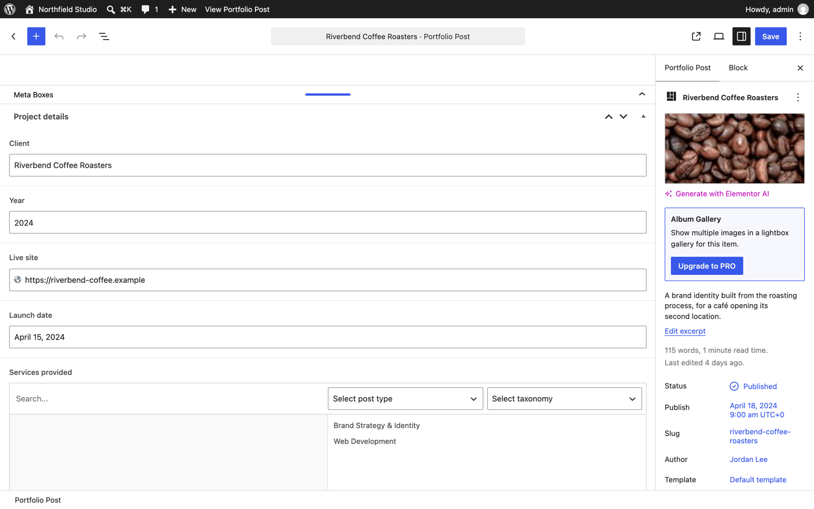

Here is what those hidden fields look like when they are working:

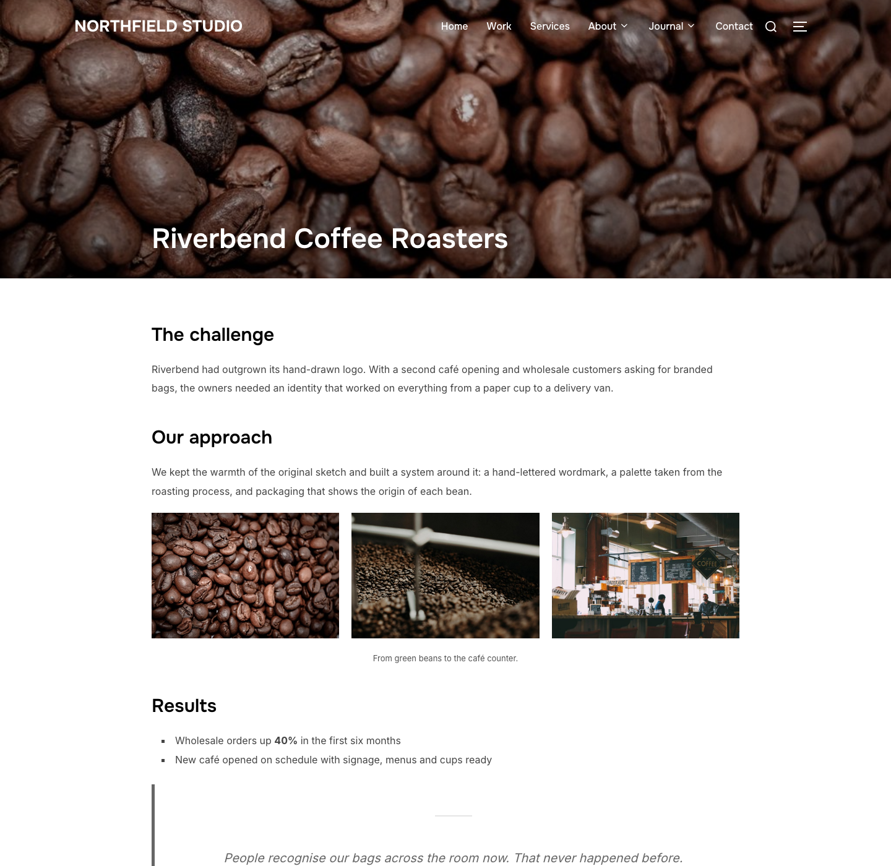

The challenge, the approach, the gallery and the results on that page are all ACF fields, and
every one of them is content somebody wrote and would expect to keep.

Here is that same entry in three states, taken from the running site.

Ask WordPress for it the way an anonymous client would, which is what a migration sees if you
skip the application password:

```
GET /wp/v2/portfolio_item?slug=riverbend-coffee-roasters

acf:            []
migration_meta: not present
```

Nothing. Now ask as an authenticated editor, with the helper plugin installed:

```
GET /wp/v2/portfolio_item?slug=riverbend-coffee-roasters&context=edit

acf:            []
migration_meta:
  client_name:      "Riverbend Coffee Roasters"
  year:             "2024"
  launch_date:      "20240415"
  results_headline: "Wholesale orders up 40%"
  results_metric:   "+40%"
  results_summary:  "Measured over the six months after launch."
```

ACF is still empty, because *Show in REST API* is off for that field group. Every value arrives
through `migration_meta` instead, which is what the helper adds. And here is the same entry
after migration, from Strapi:

```
GET /api/portfolio-items?populate=*

title:      "Riverbend Coffee Roasters"
year:       2024
launchDate: "2024-04-15"
results:    { headline: "Wholesale orders up 40%",
              metric:   "+40%",
              summary:  "Measured over the six months after launch." }
wpId:       419
wpSite:     "northfield.local"
```

Three things changed on the way across. `launch_date` was the string `"20240415"` and is now a
real date. `year` was the string `"2024"` and is now a number. The three loose `results_*` keys
are one `results` component. And `wpId` with `wpSite` are what make a second run update this
entry rather than create another one.

Here is the content type the skill generated for those entries, in Strapi's Content-Type Builder.
The three `results_*` keys are now one `Results` component with `headline`, `metric` and
`summary` inside it:

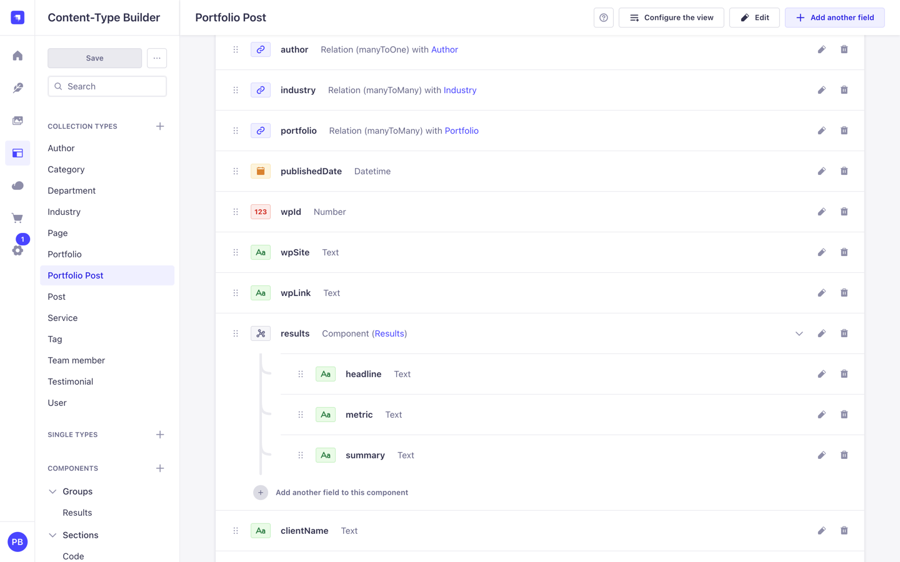

**How to check:** open `http://your-site.local/wp-json/wp/v2/types` in a browser. Compare that
list against the post types in your WP Admin menu. Anything in the menu but not in the JSON is
hidden.

**What to do:** the skill ships a temporary plugin,
`templates/wordpress/strapi-migration-helper.php`. Copy it into `wp-content/mu-plugins/`.
A must-use plugin is a PHP file WordPress loads automatically, with nothing to activate. This
one switches `show_in_rest` on for public types that opted out, and adds every custom field to
an entry as `migration_meta`. Delete it when the migration is done.

Two things about that field catch people out, including me while writing this. It only appears
on an authenticated request, and only when you ask for `context=edit`. An anonymous read of the
same entry shows `acf: []` and no `migration_meta` at all, which looks exactly like a plugin
that is not working. That is also why the application password is on the prerequisites list
rather than being optional: without it the export asks for `context=view` and gets the public
answer.

It also reports what it did. Ask it directly, using the application password, because the
endpoint only answers logged-in users:

```
curl -u admin:"xxxx xxxx xxxx xxxx xxxx xxxx" http://northfield.local/wp-json/strapi-migration/v1/info

{"version":"1.0.0","forced_post_types":["team"],"forced_taxonomies":["department"]}
```

On Northfield that is one post type and one taxonomy that would otherwise have been invisible.
Services, testimonials and projects are absent from that list because Custom Post Type UI
registered them with REST access already, which is the useful thing about the endpoint: it tells
you what was actually at risk rather than what might have been.

### Pages built with a page builder

For an Elementor page, the `content.rendered` field the API returns is Elementor's rendered
output: a deep nest of `<div class="elementor-...">` wrappers. The structure you can see on
screen lives somewhere else, in a post meta field called `_elementor_data`, stored as JSON.

This is what that structure looks like while someone is building it:

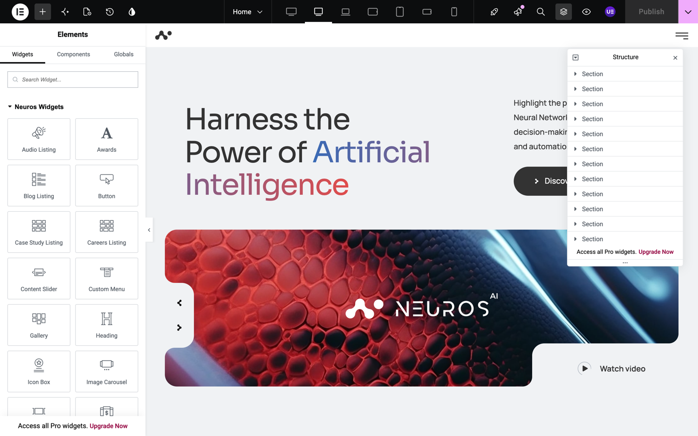

Each entry in that Structure panel is a section holding widgets, and each widget has its own
settings. That tree is what `_elementor_data` stores, and it is what a migration has to read if
the layout is going to survive.

If you flatten the rendered HTML you get the words in the right order and lose the layout. That
is fine for an article. It is poor for a landing page, which is what people build with page
builders.

So the skill has two lanes, chosen per content type:

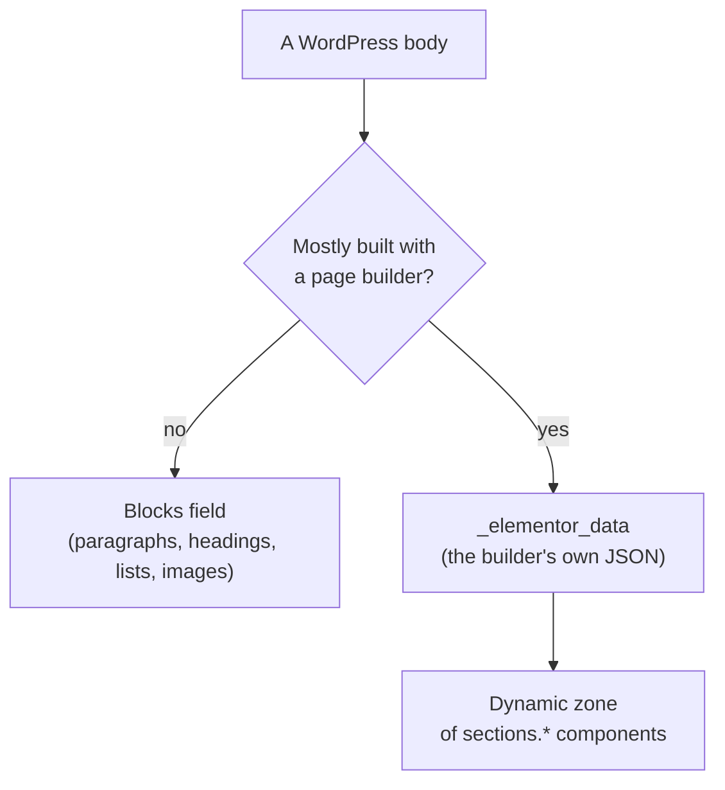

Two Strapi terms there. A **component** is a reusable group of fields stored inside an entry: a
heading plus an image plus a button, say. A **dynamic zone** is an ordered list of mixed
components, so an editor can build a page out of varied sections.

The skill reads Elementor's JSON and maps each widget to a component. A `heading` and a
`text-editor` merge into one rich-text section. An `image` becomes an image section. A
`testimonial` becomes a quote. Anything it does not recognize degrades to rich text rather than
disappearing, and gets counted by name in the report so you can see what it did not know.

**How to check:** look for `_elementor_data` in your post meta, or just open a page in WP Admin
and see whether it opens in Elementor.

#### One case study, before and after

Neuros builds its case studies in Elementor. Here is one of them on the WordPress side: a
heading and body text, with a pair of images further down the page:

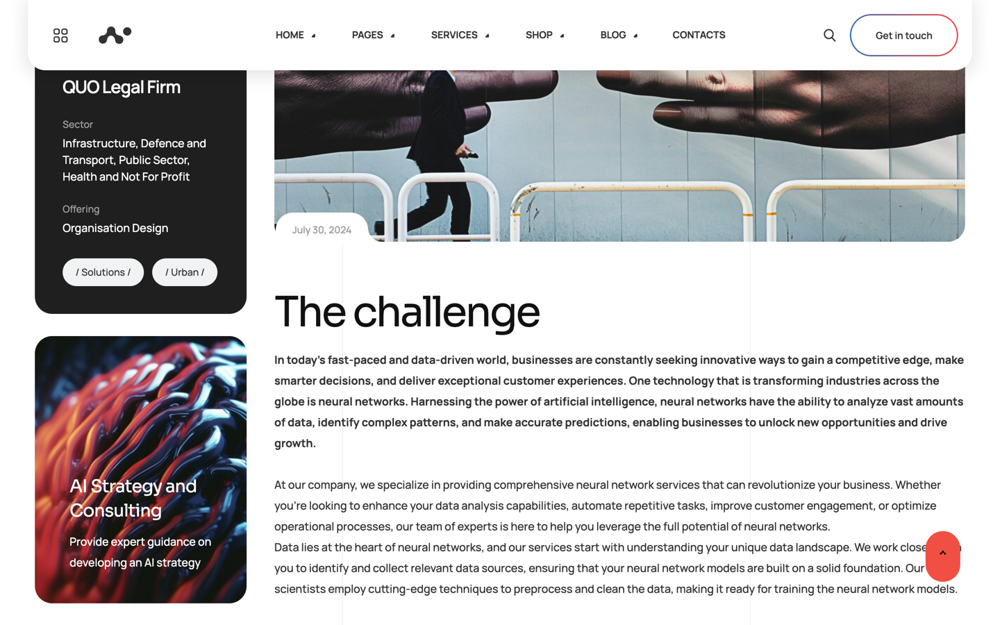

And the same entry after migration, in Strapi's Content Manager:

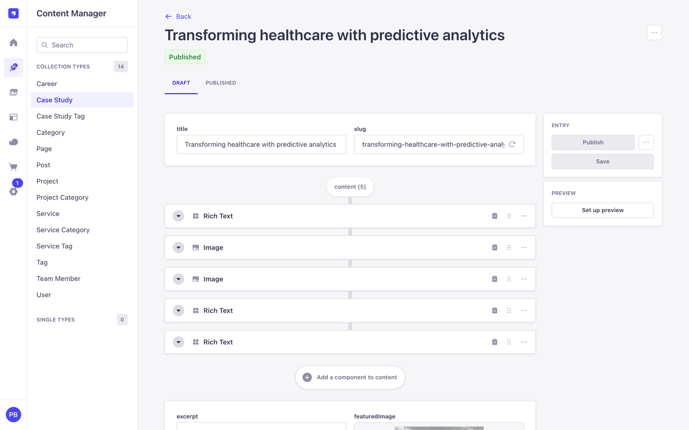

The API says the same thing:

```
GET /api/case-studies?filters[slug][$eq]=transforming-healthcare-with-predictive-analytics
    &populate[content][populate]=*

title:   Transforming healthcare with predictive analytics
wpId:    17341
wpSite:  neuros.local
content: 5 components
  1. sections.rich-text    1,556 characters
  2. sections.image        nelson-ndongala-1-min.jpg
  3. sections.image        nelson-ndongala-6-1-min.jpg
  4. sections.rich-text    2,505 characters
  5. sections.rich-text    1,319 characters
```

That is what the dynamic zone brings. An editor can reorder those five, delete one, or add a
sixth, without touching markup. The two images are real entries in Strapi's media library
rather than URLs pointing back at WordPress. In a Blocks field the same page arrives as one
long body, which reads the same on the page and cannot be rearranged by anyone who is not
comfortable editing HTML.

### Custom fields, and the shapes they arrive in

ACF and Meta Box both store values as ordinary post meta, which is a table of strings. What
comes back needs interpreting:

| What you see | What it is | What it should become |
|---|---|---|
| `"20240415"` | a date picker | a date, not a number |
| `["78","80"]` | an ACF relationship | a relation, resolved through the WordPress ids |
| `857` on a key like `hero_image` | an attachment id | a media field |
| `results_headline`, `results_metric`, `results_summary` | an ACF Group, stored flattened | one component, `results: { headline, metric, summary }` |
| `["branding", "ui", "strategy"]` | a list of values | a repeatable component |
| `[["2012 - 2017", "Microsoft Inc.", "..."], ...]` | a Meta Box repeater | a repeatable component, one row per entry |
| `_reading_time` | ACF's internal bookkeeping | ignored |

The repeater row is worth a closer look, because it shows where a tool has to stop and ask you.
Meta Box stores those rows as plain arrays with no field names anywhere. Nothing in the data
says the first column is a date range and the second is a company. The skill names a column only
when the shape is unmistakable (a URL, an icon class, a year range, a paragraph of prose) and
otherwise calls it `field2`, which you rename. A guessed name that is wrong ends up believed.

Theme settings arrive through the same channel and are not content. Neuros stores about 50
presentation keys per entry: `header_*`, `footer_*`, `page_title_*`, border radii. The skill
drops keys that look like layout settings, keys starting with `_`, and keys whose value is
identical on every entry, then lists everything it dropped so you can pull one back if it was
content after all. On the Neuros project type that was 67 dropped against 17 kept.

#### What replaces ACF on the Strapi side

ACF does two separate jobs on a WordPress site. It adds field types the editor did not have, and
it puts extra panels in the admin. Strapi splits those across two extension points, and it is
worth knowing which is which before you decide a field cannot come across.

Custom fields cover the first job, and the habits list earlier says what you get from one.
Building one means registering it twice. `strapi.customFields.register()` on the server declares
what the value is and how it validates. `app.customFields.register()` in the admin declares what
the editor sees. A field
registered on the server but not in the admin never shows up in the Content-Type Builder, which is
the usual reason a half-built one appears to do nothing.

Widgets cover the second job. `app.widgets.register()` adds a panel of your own to the admin
homepage: entries waiting on review, counts that mean something to this site, a link into whatever
tool the team actually uses.

Neither is a migration step, and neither is worth building before the content is in. They matter
because "ACF did this and Strapi does not" is usually answered by one of the two.

### Files Strapi will not accept

Strapi refuses SVG uploads unless you allow the type in Settings, Media Library, Upload. Every
logo on the Neuros theme hit this. Thirteen images stayed as WordPress URLs inside twelve pages,
which means the new site would have loaded its own logo from the old CMS.

**What to do:** allow the type in Strapi before you migrate, convert the files, or pass
`--skip-types svg` to stop the migration attempting them at all. Whichever you choose, the run
tells you once, names the type and gives the fix, rather than repeating the same error per file.

### URLs that change without you asking

Leave `urlPattern` at `null` and the skill keeps your WordPress paths, so nothing needs
redirecting. Two things still change on their own. A Strapi uid has to be ASCII, so an accented
slug gets transliterated. It also has to be unique per type, so a colliding slug gets a suffix.
Both cases produce a redirect in `redirects.json`, because those are exactly the URLs a
migration loses quietly.

## How the skill works

Six steps. Five of them are code. One is you.

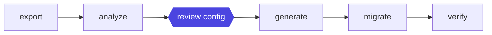

1. **export** reads your WordPress site through the REST API and writes everything to
   `wp-export/export.json`. From here on nothing touches WordPress, so the site can be slow,
   remote, or switched off.
2. **analyze** reads that file and works out what Strapi types would match. It writes
   `migration.config.json`, which drives everything after it, and `migration-plan.md`, which is
   the same plan written for a person.
3. **review** is the gate. You read the plan and change the config.
4. **generate** writes the Strapi content types and components.
5. **migrate** moves entries, media and relations in two passes. Entries first, then relations,
   because a relation needs its target to exist.
6. **verify** compares Strapi against the export and tells you what does not match.

Each step writes a file the next one reads, so you can stop anywhere, look at the file, and run
one step again without repeating the others.

These are plain Node scripts and you can run them yourself. With the skill installed, you
describe your site instead and Claude runs them for you, stopping at step 3 to wait for you.

## Set up a practice migration

Do this on the demo site before you do it on anything you care about. It takes about ten
minutes and it teaches you what the review step feels like.

### 1. Set up the demo WordPress site

The demo site comes as a single file you import into Local. The theme, the plugins and all the
content are already inside it, so there is nothing to install. Do these steps in order. Each one
says what you should see before you move on.

**Step 1. Install Local.** Download it from [localwp.com](https://localwp.com), install it and
open it. Local is a free app that runs WordPress on your own machine.

**Step 2. Download the demo site.** Download `northfield-local-site.zip` (65 MB) and leave it
zipped:

**[Download northfield-local-site.zip](https://github.com/PaulBratslavsky/wordpress-to-strapi-demo/releases/latest/download/northfield-local-site.zip)**

If the link does not start a download, get it from the
[release page](https://github.com/PaulBratslavsky/wordpress-to-strapi-demo/releases/tag/demo-site-v1).

**Step 3. Import it into Local.** In Local, click the **+** button at the bottom left. On the
**Create a site** screen, drag the zip onto the box that says *drag your file into the window to
import a site*. 

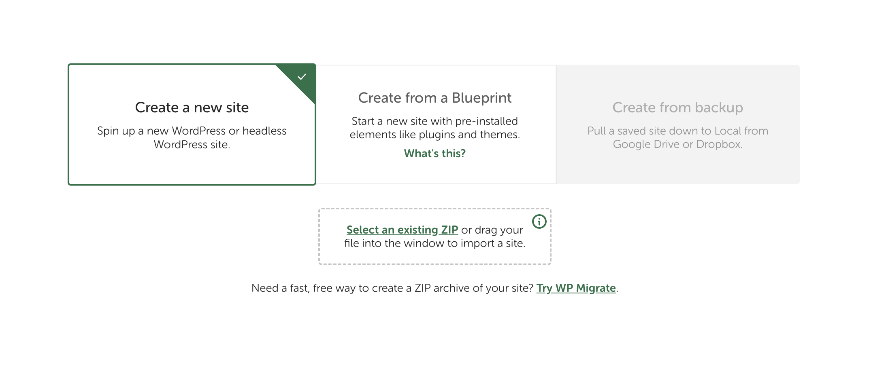

Then:

1. Type `northfield` as the site name and click **Continue**.
2. Choose **Preferred** and click **Import site**.

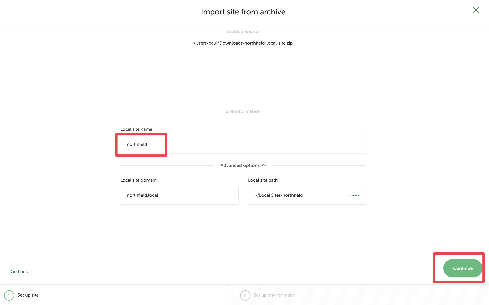

You should see: `northfield` in Local's site list with a green dot. Click **Open site** and
`http://northfield.local` shows this:

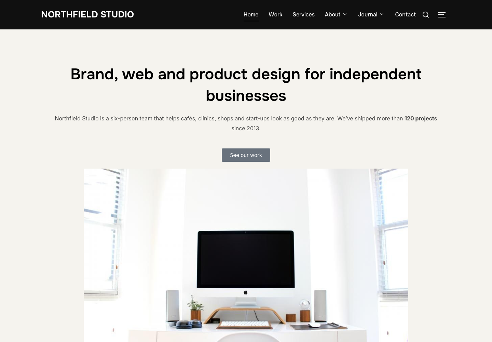

That is Northfield Studio: a fictional design agency with 8 pages, 9 posts, 5 services, 4 team
members, 4 testimonials, 6 projects, 30 images and 26 terms. It has the hard parts on purpose.
A post type hidden from the API. ACF fields hidden from the API. A classic-editor post full of
shortcodes. A draft with no slug. A scheduled post. Links to a domain that no longer exists.

**Step 4. Log in.** In Local, click **WP Admin**, then log in with:

- Username: `admin`
- Password: `password`

These are demo credentials for a site that only runs on your machine. Change them under
**Users, Profile** if you like.

**Step 5. Check the migration helper is there.** In WP Admin, go to **Plugins** and click the
**Must-Use** tab. You should see **Strapi Migration Helper**.

This small plugin comes with the demo site. It makes the post types and custom fields that
WordPress hides from its API readable, which we described earlier. WordPress loads
anything in `wp-content/mu-plugins/` automatically, so there is nothing to activate. On your own
site you add it yourself: copy
`skills/wordpress-to-strapi-migration/templates/wordpress/strapi-migration-helper.php` from this
repo into that folder, and delete it when the migration is done.

**Step 6. Create an application password.** This is the password the migration uses to read the
site, including drafts and custom fields.

1. In WP Admin, go to **Users, Profile**.
2. Scroll down to **Application Passwords**.
3. Type `strapi-migration` as the name and click **Add New Application Password**.
4. Copy the password it shows. WordPress will not show it again.

You will give it to Claude in section 3.

**Step 7. Install the migration skill.** Open a terminal and run:

```bash
npx skills add PaulBratslavsky/wordpress-to-strapi-demo -g --agent claude-code --yes
```

You should see: `✓ wordpress-to-strapi-migration (copied)` and
`→ ~/.claude/skills/wordpress-to-strapi-migration`.

This copies only the skill folder into `~/.claude/skills/`, where Claude Code finds it from any
project. You do not need the rest of this repo. It needs Node.js 20 or newer, which Strapi needs
anyway.

> **Not using Local?** The same site can be built on any WordPress 6.5+ install from the plugin in
> this repo. Clone the repo, run `./wordpress/build-plugin-zip.sh`, then on the site run
> `wp theme install inspiro --activate`,
> `wp plugin install elementor wpzoom-portfolio custom-post-type-ui advanced-custom-fields --activate`,
> `wp plugin install wordpress/dist/northfield-demo.zip --activate` and `wp northfield seed`.
> Then copy the helper plugin into `wp-content/mu-plugins/` as described in step 5.
> The [WordPress setup guide](https://github.com/PaulBratslavsky/wordpress-to-strapi-demo/tree/main/wordpress)
> has the click-through version.

### 2. Create a Strapi project

```bash
npx create-strapi-app@latest my-strapi --no-run --skip-cloud --typescript \
  --dbclient sqlite --dbfile .tmp/data.db
```

Pass `--dbfile`. Without it Strapi writes an empty `DATABASE_FILENAME=` into `.env`, then tries
to open the project folder as a database and stops with
`SqliteError: unable to open database file`.

Start it with `npm run develop`, create your admin user, then go to Settings, API Tokens, Create
new API Token and choose Full access. Keep that token.

### 3. Open Claude Code and ask

In a terminal, go to the folder that contains `my-strapi` and run `claude`. The skill you
installed in step 7 is already available.

Then describe your situation, pasting the application password from section 1 and the API token
from section 2:

```
Migrate my WordPress site at http://northfield.local into the Strapi project
at ./my-strapi, running on http://localhost:1337. My WordPress user is admin and
the application password is xxxx xxxx xxxx xxxx xxxx xxxx. The Strapi API token
is <your token>. Start with a dry run.
```

Claude copies the engine, installs it, writes the password into the engine's `.env` file, and
runs the export and the analyze step. Then it stops.

### 4. Read the plan before anything is written

This is the part worth slowing down for. Open `migration-plan.md`. It lists every content type
with its entry count, a table of every field and what it will become, the custom fields it chose
to drop and why, and the decisions worth a second look.

Five things to check:

- **`bodyMode` per type.** `blocks` for prose, `dynamic-zone` for page-builder pages, `markdown`
  if tables matter more than structure. The analyzer proposes one from the evidence. You confirm
  it.
- **Fields.** Rename anything awkward. Delete what you do not want.
- **Dropped keys.** If something in that list was actually content, move it back.
- **`urlPattern`.** Keep WordPress's URLs, or set `/blog/{slug}` and take the redirects.
- **Pages that repeat a collection.** The plan flags these:

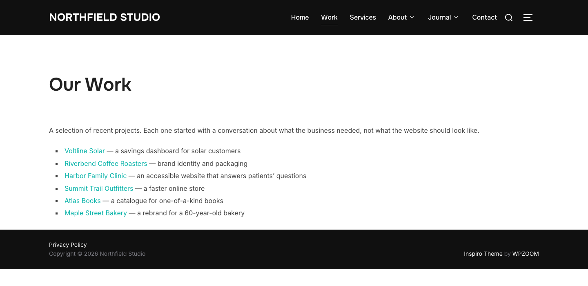

Those six projects are also six `portfolio_item` entries. The page holds them as copy, and
nothing connects the two. Strapi's own reference project, LaunchPad, models a list section as a
heading plus a relation to the collection. The plan tells you where this applies. It does not
rewrite anything, because deciding that a paragraph *is* a particular entry is a modelling
choice, and a confident wrong guess replaces real page content with a link to the wrong thing.

You can change the config by hand, or say what you want:

```
The team specialties field should be a relation to a Tag collection, not a
repeatable component. And use /blog/{slug} for posts.
```

### 5. Run it, then check what happened

Tell Claude to continue. It generates the Strapi types, waits for Strapi to reload, runs the
migration and then the verify step.

Before it writes anything it runs a preflight, which stops the run rather than half-finishing
it. It catches relations pointing at types nobody defined, dynamic zones naming components that
do not exist, unknown transforms, content types Strapi is not serving yet (usually generate ran
but Strapi has not reloaded), and a token without full access.

Two files land at the end. `migration-report.json` has everything, for grepping.
`migration-summary.md` is the same run written for a person: what moved, what failed with the id
and slug of each entry, files that could not be migrated, and the warnings grouped by kind. Each
kind gets a sentence explaining what it means, because `table-flattened ×4` only helps if you
already know what it implies. Read the summary, then go and look at what it names.

## What the two runs produced

Northfield: 12 content types, every entry migrated, verified clean.

```
┌────────────────┬───────────┬────────┬─────────────┬──────────────┬─────┐
│ (index)        │ wordpress │ strapi │ oldHostRefs │ missingMedia │ ok  │
├────────────────┼───────────┼────────┼─────────────┼──────────────┼─────┤
│ post           │ 9         │ 9      │ 0           │ 0            │ '✓' │
│ page           │ 8         │ 8      │ 0           │ 0            │ '✓' │
│ service        │ 5         │ 5      │ 0           │ 0            │ '✓' │
│ team           │ 4         │ 4      │ 0           │ 0            │ '✓' │
│ testimonial    │ 4         │ 4      │ 0           │ 0            │ '✓' │
│ portfolio-item │ 6         │ 6      │ 0           │ 0            │ '✓' │
│ author         │ 4         │ 4      │ 0           │ 0            │ '✓' │
│ category       │ 7         │ 7      │ 0           │ 0            │ '✓' │
└────────────────┴───────────┴────────┴─────────────┴──────────────┴─────┘
```

19 warnings, 0 failures. The project entries carry the ACF fields the REST API had hidden:
client, year, launch date, hero image, results, and both linked services.

Neuros: 13 content types, 343 entries and terms, 204 media files, 0 failures, 156 warnings.
Every count matches the export. Its pages, services and case studies went into dynamic zones and
produced 913 sections. Northfield's 8 pages produced 23.

Two things only showed up because we checked. The SVG refusal described earlier accounted for
twelve of the flagged pages. The other five were a false alarm: `verify.js` reported five
projects as still containing the old WordPress host, and the file had migrated correctly. The
old URL was sitting inside the attachment's caption, because that is what the caption says in
WordPress. The migration was right and the check was too blunt, so the check now counts those
separately.

## What does not come across

- **Tables, dividers and galleries inside a Blocks field.** Blocks has no node for them. Tables
  flatten to one paragraph per row, galleries become consecutive images, horizontal rules are
  dropped. Use the Markdown format to keep tables, or a dynamic zone to keep the structure.

Here is one of those tables on the demo site, in a post about color contrast:

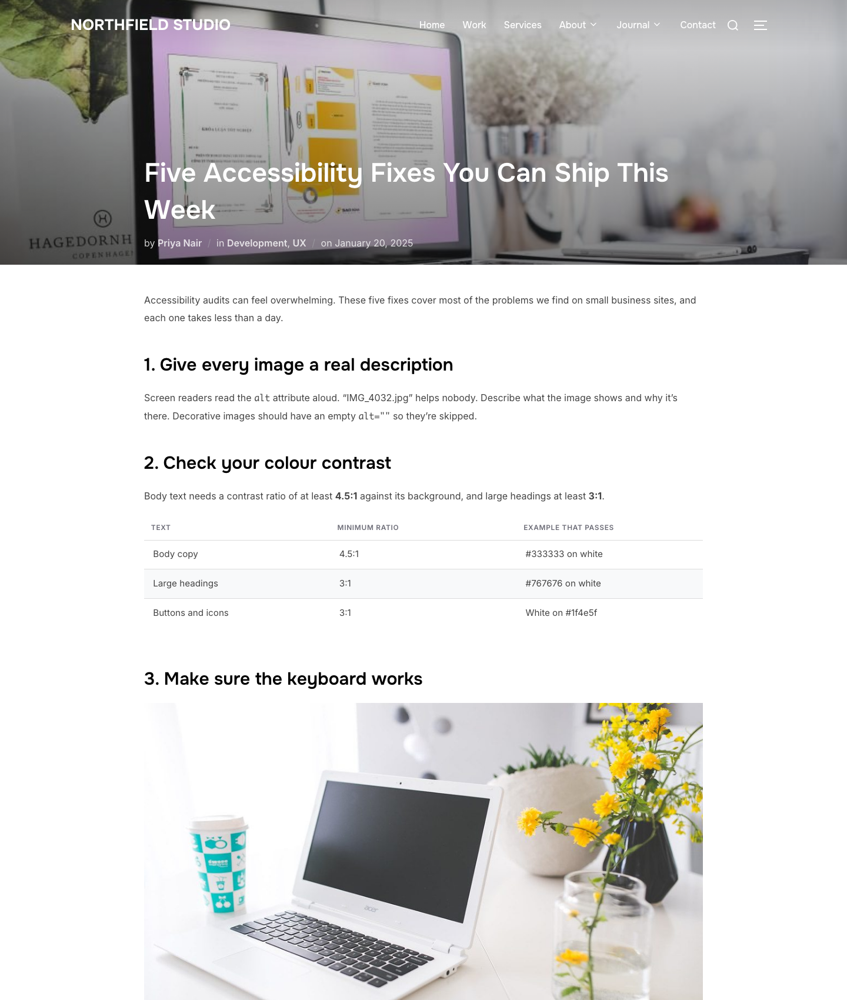

Three rows, three columns, and the ratios only mean anything next to the thing they describe.
In a Blocks field that becomes three paragraphs. The run reports it as `table-flattened` and
names the post, so you can decide whether that one is worth `--format markdown` or a dynamic
zone. Four entries on the demo site hit this.
- **Embeds, as embeds.** An iframe or a video player becomes a link. The link keeps the embed's
  own description: its title, else its caption, else the provider name, else the file name.
- **Comments.** Counted and reported, not migrated. Strapi has no built-in comments. Use a
  plugin, or add a `comment` collection with a relation to the entry.
- **Menu nesting, as nesting.** Menus do migrate, into a `navigation` single type. A Strapi
  component cannot contain itself, so items are a flat list where each one carries the id of its
  parent. Any depth survives. Your front end does the nesting.
- **WooCommerce products.** Prices, variations and stock live in WooCommerce's own tables, which
  means the WooCommerce API, not this.
- **Theme widgets with no text of their own.** Team grids, icon lists, carousels that pull from a
  custom post type. Those are rebuild candidates, and the report names them with counts.
- **Multilingual content** (WPML, Polylang). Migrate one language, then map the rest onto
  Strapi's i18n yourself.

One thing to check before you start, if your site began life as a theme's demo content. Those
demos reference the vendor's own server, and editing a few pages does not remove the rest. The
Neuros demo still held about 4,250 image references and 810 links to `demo.artureanec.com`,
inside Elementor JSON, post bodies, menus and theme settings. Those migrate across exactly as
they are, so your new site would load images from a stranger's domain. Fix it in WordPress
first, with `wp search-replace`, and run it twice: once for plain URLs, and once for the
JSON-escaped form (`https:\/\/...`) that page builders store.

## Doing it on your own site

> **This skill is a starting point, not a one-click migration.** The failure mode here is
> trusting a green checkmark.
>
> Every site has unknowns. Fields nobody registered for the API. A page builder storing layout
> somewhere the API never shows. A plugin someone installed in 2019 and forgot. The skill cannot
> know about those in advance. What it can do is report honestly: name every entry it was unsure
> about, count every widget it did not recognize, and tell you which URLs still point at the old
> server.
>
> So treat it as a loop. Run the pipeline. Read what it flagged. Adjust the config. Run it again.
> Entries are matched on their WordPress id and their source site, so re-running updates rather
> than duplicating, which is what makes the loop cheap.

A few things change once the site is real.

**Do a dry run first.** `--dry-run` converts everything and writes each entry's payload to disk
without touching Strapi. On a large site that is the cheapest hour you will spend.

**Migrate in slices.** `--only post,page` and `--limit 20` while you are still deciding what the
content should look like.

**Expect the cutover to be two runs.** People keep publishing while you work. `--since` narrows a
second pass to what changed after a date, so the catch-up takes minutes. Only post types can be
filtered, because terms and users carry no modification date, so they always run.

**Watch the files, not the entries.** Entries are fast. Files are not. The upload cache survives
restarts, so an interrupted run resumes rather than re-uploading.

**Change the skill.** It is a folder of Markdown and scripts. The component catalog in
`lib/components.js` is a table entry plus a mapping rule, so adding an accordion or a pricing
table is a few lines. The Elementor widget map in `lib/sections.js` is where your theme's widgets
go, and the run reports every widget it skipped with counts, which is the to-do list for that
file. `SKILL.md` is what Claude reads, so a house rule like "always use a dynamic zone for
landing pages" is one sentence.

**Know when this is the wrong tool.** If you are moving tens of thousands of entries, or you need
a production cutover with a rollback plan, you want purpose-built tooling and a staging rehearsal.

Everything here is in
[github.com/PaulBratslavsky/wordpress-to-strapi-demo](https://github.com/PaulBratslavsky/wordpress-to-strapi-demo):
the demo site, the skill, the engine, and the full notes from both runs.

**Citations**

- The demo site, the skill and both migration runs: https://github.com/PaulBratslavsky/wordpress-to-strapi-demo
- Strapi 5 documentation: https://docs.strapi.io
- Strapi LaunchPad, the reference project for the relation pattern: https://github.com/strapi/LaunchPad
- Strapi custom fields, for field types Strapi does not ship with: https://docs.strapi.io/cms/features/custom-fields
- Strapi admin homepage customization, for dashboard widgets: https://docs.strapi.io/cms/admin-panel-customization/homepage
- Strapi's MCP server, for querying your migrated content from an AI client: https://docs.strapi.io/cms/features/strapi-mcp-server
- Using Claude Code with Strapi over MCP: https://strapi.io/blog/claude-code-strapi-mcp-ai-content-workflows
- WordPress REST API Handbook: https://developer.wordpress.org/rest-api/
- register_post_type and show_in_rest: https://developer.wordpress.org/reference/functions/register_post_type/
- register_post_meta: https://developer.wordpress.org/reference/functions/register_post_meta/
- Must-use plugins: https://developer.wordpress.org/advanced-administration/plugins/mu-plugins/
- WPGraphQL, if you would rather stay on WordPress and go headless: https://www.wpgraphql.com/
- Advanced Custom Fields: https://www.advancedcustomfields.com/
- Meta Box: https://metabox.io/
- Local, for running WordPress on your machine: https://localwp.com
